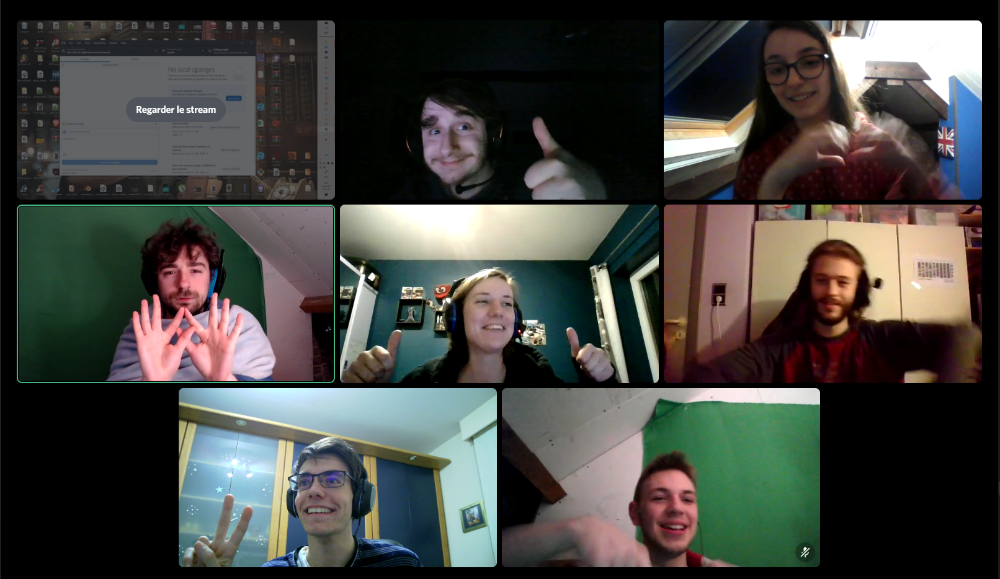

# Global Game Jam 2021

This Game was made in two days for the global game jam 2021
This was our first game jam
The theme for this year was "lost and found"

# Team

Our dev team was made out of 7 people (4 Game artists & 3 Game programmers)

Here is a discord screenshot of us

# About the game

## First person Horror

The game take place in a museum where you are lost, but beware something is chasing you, the only way to get out of this nightmare is to find the key for the exit door. Use your music box to save yourself from your biggest fear and wake up.

## Trailer

Here is the youtube trailer for the game [have a look](https://youtu.be/eqedDiPHTLQ)

## Gameplay

Want to see what it looks like ? Here it is [Watch the gameplay](https://www.youtube.com/watch?v=BIF5FTt7fB4&list=PL0bCFElq_qQxA4HfRJFxbYNizNX_S57vL)

## Play it

You can test the game by downloading the latest release version (windows build only)

[Go to the releases page](https://github.com/RLoris/GGJ-2021-A-nightmare-at-the-museum/releases)

# Tools

The game was made with unreal engine 4.25
